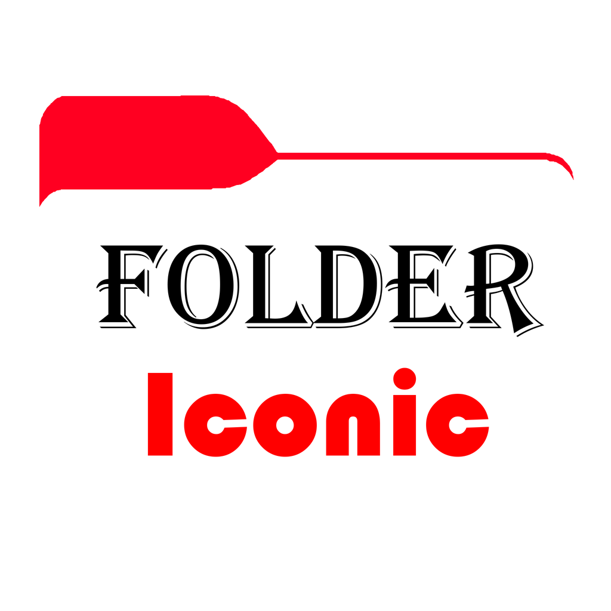

<p align="center">
  
</p>

<h1 align="center">Folder Iconic</h1>

<p align="center">
  Build custom two-tone folder icons with image and text layers, then export them as
  <code>.ico</code> or <code>.png</code>.
</p>

---

## Screenshots

### Main window

<p align="center">
  
</p>

---

## Features

- **Two-tone folder base** — recolour the front and back of the folder independently with a colour wheel, hex entry, or the system colour picker.
- **Image layers** — add PNG/JPG/BMP/GIF/WebP images with resolution cap, scale, position, opacity, and a drop shadow.
- **Text layers** — use any installed system font or load your own `.ttf` / `.otf` / `.ttc` file, with size, opacity, and shadow.
- **Recolour modes** — keep original colours, apply a solid recolour, or tint an image to match the folder.
- **Background removal** — one-click `rembg` masking (installs the optional dependency on demand).
- **Erase and restore** — paint with a soft brush to erase or restore parts of a layer, with adjustable brush size and opacity.
- **Live preview** — pan (right-drag), zoom (mouse wheel or slider), and fit the canvas while you work.
- **Export** — write multi-size Windows icons (16–256 px) or high-resolution PNGs.

## Requirements

- Windows (the icon/taskbar integration targets Windows)
- Python 3
- [Pillow](https://pypi.org/project/Pillow/) and [numpy](https://pypi.org/project/numpy/)
- Optional: [rembg](https://pypi.org/project/rembg/) — only for **Remove background**

## Getting started

The quickest way is the included batch launcher, which installs missing
dependencies and starts the app:

```bat
run.bat
```

Or run it manually:

```bat
python -m pip install Pillow numpy
python folder_iconic.py
```

## Controls

| Action | Input |
| --- | --- |
| Move a layer | Left-drag on the preview (Move tool) |
| Erase / restore | Drag on the icon with the Erase or Restore tool |
| Pan the view | Right-drag on the preview |
| Zoom | Mouse wheel, or the Zoom slider |
| Toggle layer visibility | Double-click a layer in the list |

Adjust **Brush** size, **Opacity**, and use **Clear eraser** to reset the paint mask.

## Exporting

1. Enter a **File name** in the Export panel.
2. Click **Export .ico** for a multi-size Windows icon or **Export .png** for a high-resolution image.

## Project files

| File | Purpose |
| --- | --- |
| `folder_iconic.py` | Main application |
| `svg_flattener.py` | Converts the traced SVG paths into polygon points |
| `folder_shape.svg` | Reference folder silhouette (paths are embedded in `folder_iconic.py`) |
| `Folder_Iconic.png` | App icon (window and taskbar) |
| `run.bat` | Windows launcher |
